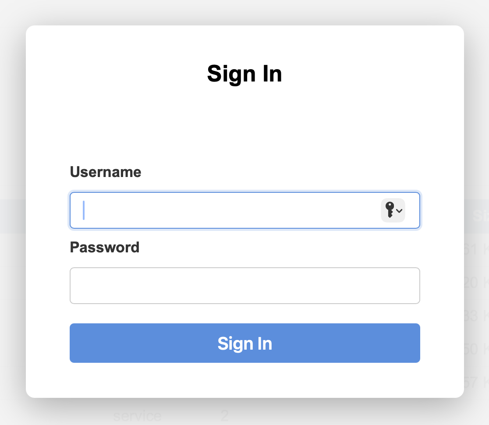

# Ego Server Dashboard

The _Ego_ server includes a built-in web dashboard that lets you monitor and manage a running
server instance from any modern web browser. No additional software is required; the dashboard
is served directly by the _Ego_ server.

&nbsp;

## Accessing the Dashboard

Point your browser at the server's hostname and port, followed by `/ui`:

```text
http://localhost:8080/ui
```

Replace `localhost:8080` with the actual host and port of your _Ego_ server. If the server
was started with TLS enabled, use `https://` instead.

&nbsp;

## Logging In

When the dashboard first loads it shows a **Sign In** overlay. Enter the username and password
for an account that has been configured on the server.



Once authenticated, the dashboard stores a bearer token in memory for the current browser
session. If the _Remember login_ setting is enabled (see [Settings](#settings) below), the
token is also written to a browser cookie that expires after 24 hours, so the login survives
a page refresh or a new tab opened to the same server.

If you remain idle for more than **15 minutes**, the dashboard automatically signs you out and
re-displays the login overlay.

### Passkey Login (FaceID / TouchID)

If the server is configured with `ego.server.allow.passkeys = true` and you are using a
browser that supports platform authenticators (Safari on macOS/iOS, Chrome on macOS, etc.),
the Sign In overlay shows a **Login using FaceID/TouchID** button beneath the standard
username/password fields. Click that button to authenticate with a previously registered
passkey instead of typing a password.

After a successful username/password login, the dashboard checks whether a passkey has
already been registered for your account. If not, and if the current browser supports
passkeys, you are prompted to store a passkey for future logins. You can dismiss the prompt
to skip passkey registration.

&nbsp;

## Header Bar

The top of every page shows:

| Area | Content |
| :--- | :--- |
| Logo & title | Ego logo and the text "Ego Server Dashboard" |
| Server name | The hostname of the server you are connected to |
| Instance ID | The server's unique UUID (useful when running multiple instances) |
| Since | The date and time the server was started (its uptime reference point) |
| ☰ (hamburger) | Opens the [Settings](#settings) sheet and the **Log Out** button |

&nbsp;

## Settings

Click the hamburger menu (☰) in the top-right corner to access settings:

| Setting | Description |
| :--- | :--- |
| **Remember login** | When enabled, the session token is saved to a browser cookie so a page refresh does not require you to sign in again. The cookie expires after 24 hours. |
| **Dark mode** | Switches the dashboard to a dark color scheme. The Code tab always uses a dark theme regardless of this setting. |

Both settings are remembered in 30-day browser cookies.

Click **Log Out** in the same menu to immediately end your session and return to the login
overlay.

&nbsp;

## Tabs

The dashboard is organized into eight tabs. Click a tab name to switch to it; the last active
tab is remembered between page loads.

| Tab | Description |
| :--- | :--- |
| [Status](#status-tab) | Server memory and cache metrics |
| [Users](#users-tab) | User account management |
| [DSNs](#dsns-tab) | Database connection list |
| [Tables](#tables-tab) | Browse tables in a DSN |
| [Data](#data-tab) | Browse and edit table rows |
| [SQL](#sql-tab) | Interactive SQL editor and builder |
| [Log](#log-tab) | Server log viewer and logger configuration |
| [Code](#code-tab) | _Ego_ code editor, debugger, and REPL |

&nbsp;

### Status Tab

The Status tab shows the memory and cache state of the running server.

**Memory metrics** — a snapshot of Go runtime statistics:

| Field | Description |
| :--- | :--- |
| Requests processed | Total HTTP requests handled since startup |
| Application memory | Total memory obtained from the operating system (bytes) |
| Heap in use | Memory currently allocated on the heap |
| Stack in use | Memory currently in use by goroutine stacks |
| Objects in use | Number of live heap objects |
| GC cycles run | Number of garbage-collection cycles completed |

**Cache status** — a summary of the server's internal caches:

| Field | Description |
| :--- | :--- |
| Cached services | Number of compiled _Ego_ service endpoints held in memory |
| Cached assets | Number of static files (HTML, CSS, JS) held in memory, and their total byte size |
| Authorizations | Number of cached access-control decisions |
| Cached tokens | Active bearer tokens in the token cache |
| Blacklisted tokens | Tokens that have been explicitly invalidated |
| User items | Cached user-account records |
| DSN entries | Cached database connection descriptors |
| Schema entries | Cached table-schema descriptions |

Below the summary a **detail table** lists each individual cached item with its endpoint name,
class, reuse count, and the time it was last accessed.

**Toolbar buttons:**

| Button | Action |
| :--- | :--- |
| Refresh | Reloads memory and cache data from the server |
| Flush Caches | Deletes all cached items, forcing the server to recompile services and reload assets on the next request |

> **Permission required:** `ego.admin`

&nbsp;

### Users Tab

The Users tab lists every user account on the server and lets you create, edit, and delete
accounts.

**User list columns:**

| Column | Description |
| :--- | :--- |
| Username | The login name for the account |
| User ID | An internal identifier assigned by the server |
| Permissions | Comma-separated list of capabilities granted to this user (e.g. `ego.logon, ego.admin`) |

**Creating a user** — click **New User** to open the creation sheet:

1. Enter a **Username**.
2. Enter a **Password**.
3. Enter one or more **Permissions**, separated by commas.
4. Click **Save**.

**Editing a user** — click any row in the table to open the edit sheet:

* The username is shown but cannot be changed here.
* Enter a **New password** to change the password, or leave the field blank to keep the
  current password.
* Edit the **Permissions** field as needed.
* Click **Save** to apply changes, or **Delete** to remove the account entirely.

When `ego.server.allow.passkeys` is enabled, the edit sheet also shows passkey buttons:

| Button | Action |
| :--- | :--- |
| **+ Passkey** | Register a new passkey for this account using the browser's platform authenticator. |
| **- Passkey** | Remove all passkeys stored for this account. Available to the account owner and to administrators. |

Common permission values:

| Permission | Grants |
| :--- | :--- |
| `ego.logon` | Ability to authenticate (required for all interactive use) |
| `ego.admin` | Full administrative access: users, loggers, caches, memory stats |
| `ego.code.run` | Ability to execute arbitrary _Ego_ code in the Code tab |
| `ego.dsn.admin` | Ability to manage data source connections |

> **Permission required:** `ego.admin`

&nbsp;

### DSNs Tab

DSN stands for _Data Source Name_ — a named connection descriptor that tells the server how
to connect to a database. The DSNs tab lists every DSN configured on the server.

**Columns:**

| Column | Description |
| :--- | :--- |
| Name | The identifier used to reference this connection in _Ego_ programs and REST requests |
| Provider | Database engine: `sqlite3`, `postgres`, `mysql`, etc. |
| Database | Name of the database (or file path for SQLite) |
| Host | Hostname of the database server (blank for SQLite) |
| Port | TCP port (blank for SQLite) |
| User | Database login username |
| Secured | `Yes` if the connection uses SSL/TLS |
| Restricted | `Yes` if access to this DSN is limited to admin users |

DSN management (creating and deleting connections) is done through the _Ego_ CLI or the REST
API. The dashboard displays the current DSN list for reference. See
[Ego Table Server Commands](TABLES.md) for more information.

> **Permission required:** `ego.admin`

&nbsp;

### Tables Tab

The Tables tab lets you browse the database tables available through a DSN.

1. Select a **DSN** from the dropdown at the top of the tab. The table list updates
   automatically.
2. The table list shows the **name**, **schema**, **column count**, and **row count** for
   each table.
3. Click any table row to open a **detail sheet** listing each column's name, data type,
   size, and whether it is nullable or must contain a unique value.

> **Permission required:** access to the selected DSN

&nbsp;

### Data Tab

The Data tab lets you browse and edit the rows stored in a database table.

**Selecting data:**

1. Choose a **DSN** from the first dropdown.
2. Choose a **Table** from the second dropdown (populated automatically when a DSN is
   selected).
3. The rows of the selected table are loaded and displayed.

**Reading the data grid:**

* Each column in the table becomes a column in the grid.
* Numeric columns (`int`, `float`, and related types) are right-aligned.
* Fields that contain no value are shown as `null` in italic grey text.
* Float values always display a decimal point (e.g. `42.0`) to distinguish them from
  integers.
* A **row count** summary is shown below the grid.

**Choosing visible columns** — click **Columns** to open a picker sheet:

* Toggle individual columns on or off using the checkboxes.
* Click **Select all** to make every column visible again.
* The selection resets automatically when you switch to a different DSN or table.

**Editing a row** — click any row in the grid to open an edit sheet:

* All fields for that row are shown.
* Modify field values and click **Edit** to save changes back to the database.
* Click **Delete** to remove the row (only available for rows that have a row ID).
* Click **Cancel** to close the sheet without changes.
* If a row has no internal row ID, the sheet shows a message indicating that the row
  cannot be modified through the dashboard.

> **Permission required:** access to the selected DSN and table

&nbsp;

### SQL Tab

The SQL tab provides an interactive SQL environment for running queries and modifying data
in any DSN connected to the server. It includes a syntax-highlighted editor, a statement
preprocessor, and a point-and-click wizard for building common SQL statements.

&nbsp;

#### Toolbar

| Control | Description |
| :--- | :--- |
| **DSN** picker | Selects the database connection that all statements in the editor will run against. |
| **✕ Clear** | Clears the editor contents and any previous results. |
| **🔨 Build** | Opens the SQL Build wizard to construct a statement interactively. |
| **▶ Submit** | Executes all statements in the editor. Keyboard shortcut: **Ctrl+Enter** (or **Cmd+Enter** on macOS). |
| **📂 Open** | Opens a file picker to load a `.sql` or `.txt` file from your local disk into the editor. |
| **💾 Save** | Saves the current editor contents to a file. On Chrome and Edge the browser shows a native Save dialog; on other browsers the file is downloaded to the default Downloads folder. |

&nbsp;

#### Writing SQL

Type or paste one or more SQL statements into the editor. The editor highlights SQL keywords,
type names, string literals, numeric literals, and comments as you type.

**Multiple statements** are separated by semicolons. Each statement can span multiple lines;
the preprocessor joins continuation lines automatically before sending them to the server.

**Comment lines** — any line whose first non-whitespace characters are `//` is treated as a
comment and stripped before execution. This lets you annotate your queries without affecting
what the server sees:

```sql
// Fetch recent orders for reporting
SELECT order_id, customer, total
FROM orders
WHERE created_at > '2024-01-01'
ORDER BY created_at DESC;
```

**DSN hint** — a special comment of the form `// <name> dsn` (placed anywhere in the
editor) automatically switches the DSN picker to the named connection when you press Enter
at the end of that line:

```sql
// production dsn
SELECT count(*) FROM customers;
```

This is convenient for saved query files that are always intended to run against a specific
database.

**Results** appear below the editor:

* A `SELECT` that returns rows is shown as a scrollable table. The internal `_row_id_` column
  is always hidden.
* Any other statement (INSERT, UPDATE, DELETE, CREATE, etc.) shows the number of rows
  affected.
* Errors are shown in red.

> **Note:** When multiple statements are submitted together, only the last statement's rows
> are returned. A warning banner is shown if a `SELECT` that is not the last statement is
> detected, because its results will be discarded.

&nbsp;

#### SQL Build Wizard

Click **🔨 Build** to open the SQL Build wizard. The wizard slides in from the right and
guides you through building a complete SQL statement without typing.

1. Choose a **Statement type** from the dropdown at the top of the wizard.
2. Fill in the fields for that statement type (described below).
3. The generated SQL appears in the preview pane at the bottom of the wizard as you make
   selections — it updates live with every change.
4. Click **Insert** to append the generated statement to the editor at the current cursor
   position, then close the wizard.
5. Click **Cancel** to close the wizard without inserting anything.

&nbsp;

##### SELECT

Build a `SELECT … FROM … WHERE … ORDER BY` query.

| Section | Description |
| :--- | :--- |
| **Table** | Pick the table to query from the dropdown. |
| **Columns** | Check **Select all columns (\*)** to use `SELECT *`, or uncheck it to choose individual columns from the grid. |
| **WHERE clause** | Click **+ Add condition** to add a filter row. Each row has a column picker, an operator (`=`, `<>`, `<`, `<=`, `>`, `>=`, `IS NULL`, `IS NOT NULL`, `LIKE`, `NOT LIKE`), and a value field. Multiple conditions are combined with `AND`. Remove a condition with the **✕** button. |
| **ORDER BY** | Click **+ Add column** to add a sort row. Each row has a column picker and an `ASC`/`DESC` direction. Multiple sort columns are listed in order. |

**Example output:**

```sql
SELECT order_id, customer, total
FROM orders
WHERE status = 'open'
  AND total >= 100
ORDER BY created_at DESC
```

&nbsp;

##### INSERT

Build an `INSERT INTO … VALUES (…)` statement.

| Section | Description |
| :--- | :--- |
| **Table** | Pick the target table. |
| **Values** | One row per column. Each row shows the column name, its SQL type, a value input, and a **Null** button. Type the value to insert; click **Null** to insert a SQL `NULL` instead. The internal `_row_id_` column is not shown — it is assigned automatically by the database. |

String values are automatically single-quoted in the preview; numeric values are left
unquoted. A bullet (•) after the type hint indicates the column does not allow `NULL`.

**Example output:**

```sql
INSERT INTO customers
  (name, email, active)
VALUES
  ('Alice', 'alice@example.com', 1)
```

&nbsp;

##### UPDATE

Build an `UPDATE … SET … WHERE …` statement.

| Section | Description |
| :--- | :--- |
| **Table** | Pick the target table. |
| **SET values** | One row per column. Each row starts unchecked and dimmed. Check the box next to a column to include it in the `SET` clause and enable its value input. Click **Null** to set the column to `NULL`. |
| **WHERE** | Works the same as the SELECT WHERE section. A unique key column (or `_row_id_`) is pre-populated when the table is selected. |

If you click **Insert** without any WHERE conditions, the wizard shows a confirmation dialog
warning that the statement will update **all rows** in the table. If you confirm, the
statement is inserted with a warning comment prepended:

```sql
// WARNING: this statement affects all rows
UPDATE products
SET price = 9.99
```

&nbsp;

##### DELETE

Build a `DELETE FROM … WHERE …` statement.

| Section | Description |
| :--- | :--- |
| **Table** | Pick the target table. |
| **WHERE** | Works the same as the UPDATE WHERE section. A unique key column (or `_row_id_`) is pre-populated when the table is selected to help prevent accidental bulk deletes. |

The same no-WHERE confirmation dialog applies: attempting to insert a DELETE without any
WHERE conditions prompts you to confirm before inserting the statement with a warning comment.

**Example output:**

```sql
DELETE FROM orders
WHERE order_id = 1042
```

&nbsp;

##### CREATE TABLE

Build a `CREATE TABLE (…)` statement to define a new table in the selected DSN.

| Section | Description |
| :--- | :--- |
| **Table name** | Type the name of the new table. An inline indicator shows ✔ when the name is available or ✘ when a table with that name already exists in the DSN. The Insert button is disabled until a valid, unique name is entered. |
| **Columns** | Click **+ Add column** to add a column definition row. Each row has a **Name** input, a **Type** dropdown, a **Unique** checkbox, and a **Nullable** checkbox (checked by default). Remove a column with the **✕** button. At least one column is required. |

The **Type** dropdown offers the most commonly used SQL data types:

```text
VARCHAR  TEXT     CHAR      INT      INTEGER  BIGINT   SMALLINT
FLOAT    DOUBLE   DECIMAL   NUMERIC  BOOLEAN
DATE     DATETIME TIMESTAMP UUID     JSON
```

Column constraints are added in this order: `NOT NULL` (when Nullable is unchecked), then
`UNIQUE` (when Unique is checked).

**Example output:**

```sql
CREATE TABLE customers (
    id INTEGER NOT NULL UNIQUE,
    name VARCHAR NOT NULL,
    email VARCHAR,
    active BOOLEAN NOT NULL
)
```

&nbsp;

> **Permission required:** access to the selected DSN and table

&nbsp;

### Log Tab

The Log tab displays the server's log output and lets you configure which categories of
messages are written to the log.

**Viewing the log:**

* The log viewer shows the most recent lines from the server log file (default: 500 lines).
* Use the scrollbar to move through earlier entries.

**Searching the log:**

1. Type a search term in the search box.
2. Click **Find** (or press Enter) to highlight the first match.
3. Use **Next** and **Prev** to move between matches.
4. The status area shows the current match position (e.g. `Match 5 of 23`).
5. Click **✕** next to the search box to clear the search.

**Toolbar buttons:**

| Button | Action |
| :--- | :--- |
| Refresh | Reloads the log from the server |
| Go to End | Scrolls the log viewer to the most recent entries |
| Configure | Opens the Logger Configuration sheet |

**Logger Configuration sheet:**

* **Log file path** — the path of the current server log file (read-only).
* **Keep previous logs** — the number of rotated log files to retain when the log is purged.
* **Lines to fetch** — how many trailing lines to load each time the log tab is refreshed.
  This preference is saved in a browser cookie.
* **Logger toggles** — a toggle switch for each available logging category. Enabling a
  logger causes the server to start writing that category of messages immediately; disabling
  it stops them. Changes take effect as soon as you click **Save**.

Available log categories:

| Logger | What it records |
| :--- | :--- |
| AUTH | Authentication and authorization decisions |
| BYTECODE | Disassembly of compiled _Ego_ pseudo-instructions |
| CLI | Command-line argument processing |
| COMPILER | Package imports and source-file compilation steps |
| DB | Database connection lifecycle events |
| REST | HTTP request and response details for the server |
| SERVER | High-level server lifecycle events |
| SYMBOLS | Symbol table creation, lookup, and scope transitions |
| TABLES | SQL statements generated by the `/tables` REST endpoint |
| TRACE | Execution of every _Ego_ virtual-machine instruction |
| USER | Messages generated by `@LOG` directives inside _Ego_ programs |

> **Permission required:** `ego.admin` for logger configuration; no special permission is
> needed to view the log.

&nbsp;

### Code Tab

The Code tab is an interactive development environment that lets you write, run, and
debug _Ego_ programs directly in the browser.

&nbsp;

#### Layout

```text
┌──────────────────────────────────────────────────────────┐
│  [Open]  [Clear]              [Trace ▣]    [Run ▾]       │
├──────────────────────┬───────────────────────────────────┤
│                      │                                   │
│  Editor              │  Output  /  Debugger              │
│  (left pane)         │  (right pane)                     │
│                      │                                   │
├──────────────────────┴───────────────────────────────────┤
│  Console (REPL)                              [Clear]     │
│  ego> _                                                  │
└──────────────────────────────────────────────────────────┘
```

The vertical divider between the editor and the right pane, and the horizontal divider
above the console, can both be dragged to resize the panes.

&nbsp;

#### Editor Pane

* Type or paste _Ego_ source code into the editor. Syntax is highlighted as you type.
* Line numbers are shown on the left edge.
* Click **Open** to load an `.ego` file from your local disk into the editor.
* Click **Clear** to erase the editor contents.
* **Ctrl+Enter** (or **Cmd+Enter** on macOS) runs the code without reaching for the mouse.

&nbsp;

#### Running Code

Click the **Run** button to compile and execute the code in the editor. A spinner appears
while the server processes the request, and the button is disabled until the run completes.

**How execution works:**

* If the editor contains a function named `main` — declared as `func main()` — that
  function is called automatically. This lets you structure your code the way a real Go
  program would be structured, with helper functions and a clear entry point.
* If there is no `func main()`, every top-level statement in the editor is executed in
  order, as a script.

Output from `fmt.Print`, `fmt.Println`, and similar calls appears in the **Output pane**
on the right. Compiler errors and runtime errors are also shown there, highlighted in red.
The elapsed run time is displayed below the output when the run completes.

&nbsp;

#### Run Modes

The **Run** button includes a dropdown arrow (▾) that lets you choose the execution mode.
The selected mode is remembered until you change it.

| Mode | Description |
| :--- | :--- |
| **▶ Run** | Normal execution. Output goes to the Output pane. |
| **🐛 Debug** | Runs the program under the interactive debugger (see [Debug Mode](#debug-mode) below). |

**Trace toggle** — the **Trace** button to the left of the Run button is an on/off toggle
(the indicator fills when active). When enabled, the server sends a full instruction-by-
instruction trace of the _Ego_ virtual machine to the Output pane alongside any program
output. This is useful for understanding exactly how the runtime executes your code or for
diagnosing unexpected behavior. Trace can be combined with either Run or Debug mode.

&nbsp;

#### Debug Mode

Selecting **🐛 Debug** from the Run dropdown starts an interactive debugging session.
The right pane switches from the Output view to the **Debugger panel**, which shows:

* **Debugger output** — messages from the debugger (breakpoint hits, variable values, etc.)
* **Program output** — any output your program prints while paused or stepping
* **Toolbar buttons** — shortcuts for the most common stepping commands:

  | Button | Debugger command |
  | :--- | :--- |
  | **Go** | `continue` — resume execution until the next breakpoint or end of program |
  | **Step** | `step` — execute one statement, stepping _into_ function calls |
  | **Step Over** | `step over` — execute one statement, stepping _over_ function calls |
  | **Step Return** | `step return` — run until the current function returns |

* **Command input** — a `debug>` prompt where you can type any debugger command and press
  **Send** (or Enter) to execute it.

Type `help` at the `debug>` prompt to display the full command reference. The available
commands are:

| Command | Description |
| :--- | :--- |
| `break at <line>` | Halt execution when the given line is reached |
| `break when <expression>` | Halt execution when an _Ego_ expression evaluates to true |
| `break clear at <line>` | Remove the breakpoint at the given line |
| `break clear when <expression>` | Remove the conditional breakpoint for the given expression |
| `break load ["file"]` | Restore breakpoints from a previously saved file |
| `break save ["file"]` | Save the current breakpoint list to a file |
| `continue` | Resume execution until the next breakpoint or program end |
| `exit` | End the debug session |
| `help` | Display this command reference |
| `print <expression>` | Print the value of any _Ego_ expression |
| `set <variable> = <expression>` | Assign a new value to a variable while paused |
| `show breaks` | List all active breakpoints |
| `show calls [<n>]` | Display the call stack to a given depth |
| `show line` | Show the source line currently being executed |
| `show scope` | Display the nested call scope and symbol table chain |
| `show source [<start>[:<end>]]` | Display source lines from the current module |
| `show symbols` | Display all variables in the current scope |
| `step [into]` | Execute one statement, stepping into any function call |
| `step over` | Execute one statement, stepping over function calls |
| `step return` | Run until the current function returns |

The debug session ends automatically when the program finishes, or when you send `exit`
or click the **✕** (clear debugger output) button.

&nbsp;

#### Console Pane (REPL)

The console at the bottom of the tab provides a read-eval-print loop (REPL). Type a
single _Ego_ statement at the `ego>` prompt and press **Enter** to execute it immediately.
The result or any output appears directly below the prompt.

The key difference between the editor and the console:

| | Editor | Console |
| :--- | :--- | :--- |
| Execution | Runs the entire program (or calls `func main()`) on each **Run** | Executes one statement at a time as you type |
| Symbol table | Fresh on every **Run** — variables from one run are gone in the next | **Persistent** across statements — variables declared in earlier statements remain available |
| Use case | Writing and testing complete programs | Exploratory, incremental work; quick calculations |

The persistent symbol table for the console is stored on the server and is tied to the
specific browser tab (identified by a UUID generated when the page loads). Symbol tables
for inactive sessions are automatically cleaned up by the server after one hour of
inactivity.

> **Permission required:** `ego.code.run` (and `ego.admin`)

&nbsp;

## Keyboard Shortcuts

| Shortcut | Where | Action |
| :--- | :--- | :--- |
| Ctrl+Enter / Cmd+Enter | SQL editor | Submit all statements |
| Ctrl+Enter / Cmd+Enter | Code editor | Run the program |
| Enter | Code console | Execute the current console statement |
| Enter | Log search box | Find the next match |

&nbsp;

## Related Documentation

* [Ego Server](SERVER.md) — starting and configuring the _Ego_ REST server
* [Ego Server APIs](API.md) — REST endpoints that the dashboard uses internally
* [Ego Table Server Commands](TABLES.md) — managing DSNs and database tables
* [Language Reference](LANGUAGE.md) — _Ego_ language syntax for use in the Code tab
